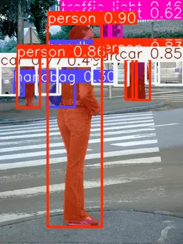

# Custom endpoints example

This folder contains a simple example showing how to add custom endpoints to your model bundle.

## Defining custom endpoints

Endpoints are defined in `endpoints.yaml`. Each endpoint specifies:

- The path (endpoint)
- The HTTP method (GET or POST)
- The Python method to call (function_name)

Example from `endpoints.yaml`:

```yaml
endpoints:
  - endpoint: /models
    http_method: GET
    function_name: get_models
  - endpoint: /v1/detect-image
    http_method: POST
    function_name: detect_image
  - endpoint: /v1/segment-image
    http_method: POST
    function_name: segment_image
```

Add a new endpoint by appending to the `endpoints` list:

```yaml
endpoints:
  # ...
  - endpoint: /my/new/endpoint
    http_method: GET
    function_name: do_something
```

## Example functions

Custom endpoint logic lives in `model.py`. This example provides three functions:

- `get_models()`: Returns the metadata about the models loaded in the `Model.__init__` method.
- `detect_image(model_input)`: Returns the bounding box, label and confidence of objects in an image.
- `segment_image(model_input)`: Returns a message and the input string repeated 3 times.

Edit these functions to apply your own logic.

## Usage

1. Add `endpoints.yaml`, `model.py`, `yolo26n.pt`, and `yolo26n-seg.pt` to a new model bundle on OICM and deploy it.
2. Make:
   - a GET request to `/models` or
   - a POST request to `/v1/detect-image` with a base64-encoded image or
   - a POST request to `/v1/segment-image` with a base64-encoded image.
3. The server will use the code in `model.py` to generate a JSON response.

### GET /models

Example request:

```bash
curl http://<inference_url>/models | jq
```

Example response:

```
{
  "models": [
    {
      "name": "yolo26n",
      "checkpoint": "yolo26n.pt",
      "date": "2025-12-15T06:36:05.381708",
      "task": "detect"
    },
    {
      "name": "yolo26n-seg",
      "checkpoint": "yolo26n-seg.pt",
      "date": "2026-01-03T12:45:42.594574",
      "task": "segment"
    }
  ]
}
```

### POST /v1/detect-image

Example request:

```bash
curl http://<inference_url>/v1/detect-image -H 'Content-type: application/json' -d '{"image_base64": "UklGRuh5AgBXRUJQV..."}' | jq
```

Example response:

```
{
  "predictions": [
    {
      "bbox": [
        [
          106.77693176269531,
          995.8170776367188,
          1640.213134765625,
          1640.3740234375
        ]
      ],
      "confidence": [
        0.9308338761329651
      ],
      "label": "car"
    },
    ...
  ]
}
```

### POST /v1/segment-image

Example request:

```bash
curl http://<inference_url>/v1/segment-image \
  -H "Content-type: application/json" \
  -d "{\"image_base64\": \"$(cat zagreb-girl-1465190.webp | base64)\"}" \
  | jq -r '.segmented_image' \
  | base64 -d > segmented.webp
```

Example response:



## Files

The following is a list of files necessary for this model bundle

- `endpoints.yaml`: Defines the custom endpoints.
- `model.py`: Contains logic for the endpoints.
- `yolo26n.pt`: YOLO image detection model weights (from https://docs.ultralytics.com/tasks/detect/)
- `yolo26n-seg.pt`: YOLO image segmentation model weights (from https://docs.ultralytics.com/tasks/segment/)
- `requirements.txt`: List of additional Python packages that the model server will install.
